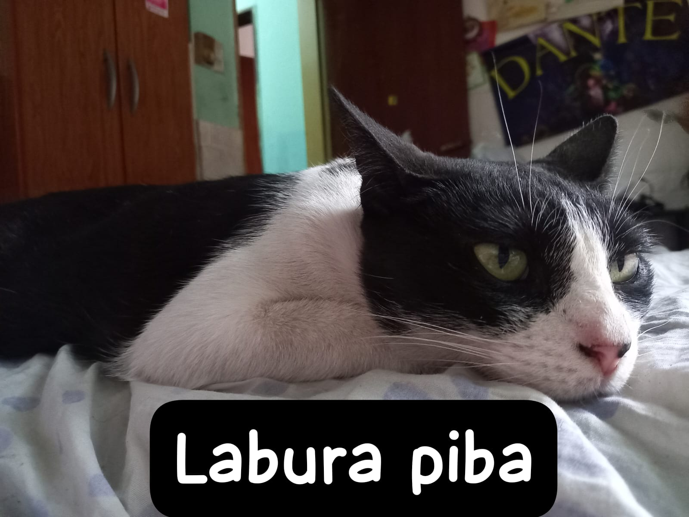

# Pagina-Mei

Este proyecto consiste en una página web diseñada y desarrollada para presentar a mi adorable gata utilizando HTML y CSS. El propósito principal es demostrar conocimientos en el desarrollo web front-end.

## Descripción

La página web está dedicada a mi gata y tiene como objetivo mostrar su encanto, personalidad y momentos adorables a través de un sitio web sencillo pero bien diseñado.

## Características

- **HTML y CSS:** El sitio está construido principalmente con HTML para la estructura y CSS para los estilos.
- **Contenido Estático:** Se presenta información estática sobre mi gata, incluyendo fotos, una breve descripción y posiblemente algunos hechos interesantes.
- **Estilos Personalizados:** Los estilos han sido personalizados para reflejar la personalidad de mi gata y brindar una experiencia visual atractiva.

## Estructura del Proyecto

El repositorio está organizado de la siguiente manera:

- **`index.html`:** El archivo principal que contiene la estructura y contenido de la página.
- **`styles.css`:** Archivo que contiene los estilos y la apariencia visual de la página.
- **Carpeta `imagenes`:** Almacena las imágenes utilizadas en la página.

Ver pagina: https://melisaarce.github.io/Pagina-Mei/
